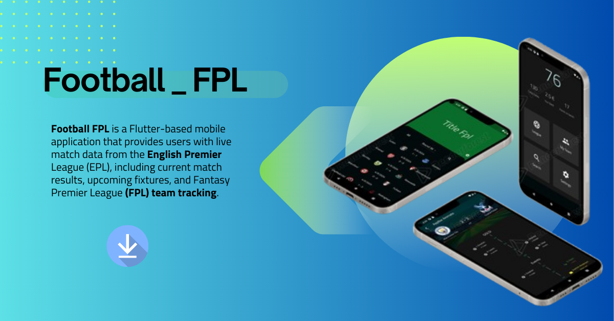
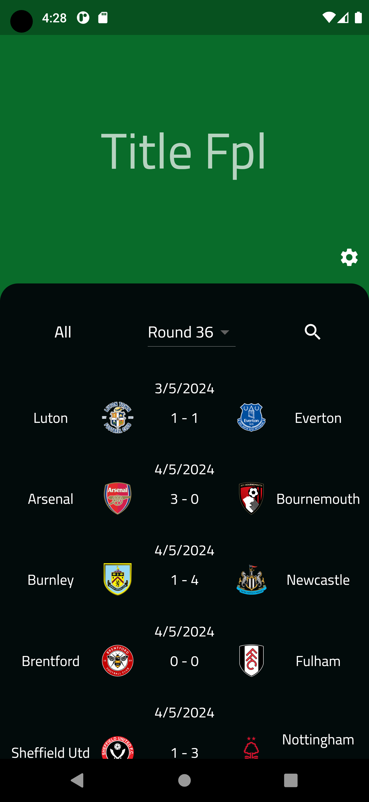
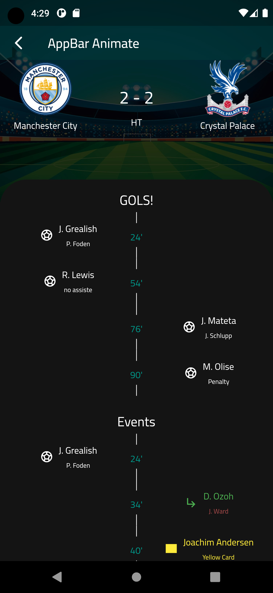
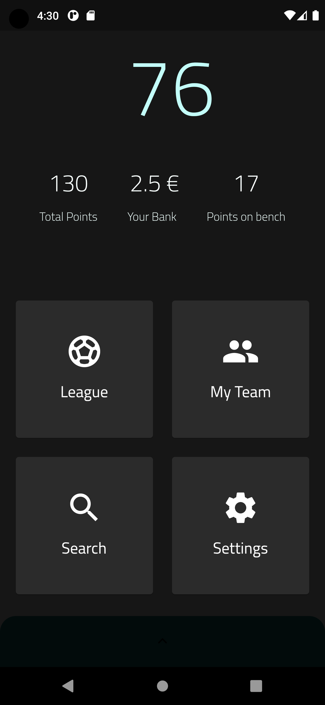

# Football FPL

**Football FPL** is a Flutter-based mobile application that provides users with live match data from the English Premier League (EPL), including current match results, upcoming fixtures, and Fantasy Premier League (FPL) team tracking. The app interacts with the official EPL API to fetch live data and display it in an easy-to-navigate interface.


## Features

### 1. **Live Match Results**

- Get real-time updates for ongoing matches in the English Premier League.
- View detailed match information such as the score, teams involved, and match status.

### 2. **Upcoming Fixtures**

- Browse upcoming matches in the Premier League for the current season.
- View the schedule of future matchdays, including dates, teams, and venues.

### 3. **Fantasy Premier League (FPL) Tracking**

- Monitor your Fantasy Premier League (FPL) team’s performance.
- Track the points scored by your players in real-time.
- See detailed statistics like team rank, transfers, and top scorers.

## Screenshots

### Home Screen

The home screen displays the latest Premier League results and upcoming fixtures in an easy-to-read list format.


### Match Results

Users can click on a specific match to view more details such as goalscorers, match events, and a breakdown of the final score.


### FPL Dashboard

The Fantasy Premier League dashboard allows users to track their team’s points, check player statistics, and make real-time updates to their fantasy team.


## Installation

To get started with the Football FPL app, follow these installation steps:

1. **Clone the repository**:
   First, clone the repository to your local machine using Git:
   ```bash
   git clone https://github.com/username/football_fpl.git

   ```
2. **Navigate to the project directory: After cloning the repo, move into the project directory:**
   cd football_fpl

3. **Install dependencies: Run the following command to fetch all required dependencies:**
   flutter pub get

4. **Run the app: Launch the app on an emulator or a connected device:**
   flutter run

### Breakdown of Sections:

1. **Introduction**: Provides an overview of what the app does (fetches live data for Premier League matches and tracks Fantasy Premier League teams).
2. **Features**: Describes the key features of the app, including live match results, upcoming fixtures, and Fantasy Premier League tracking.

3. **Screenshots**: Displays images of the app’s UI, such as the home screen, match results, and Fantasy Premier League dashboard. Make sure to place your images in the `assets/screenshots/` folder and update the file paths accordingly.

4. **Installation**: Guides users on how to clone the repo, install dependencies, and run the app locally.

5. **Technologies Used**: Lists the main technologies used to build the app, such as Flutter and the APIs for Premier League and Fantasy Premier League data.

6. **Contributing**: Encourages open-source contributions and provides clear steps for how users can contribute.

7. **License**: Mentions that the project is licensed under the MIT License, which is a permissive open-source license.

8. **Acknowledgments**: Thanks the external sources (like APIs) that were used to build the app.

Make sure to replace placeholders like `https://github.com/username/football_fpl.git` with your actual GitHub repository URL and update image paths based on where the screenshots are stored in your project.

Let me know if you need further modifications or additions!
